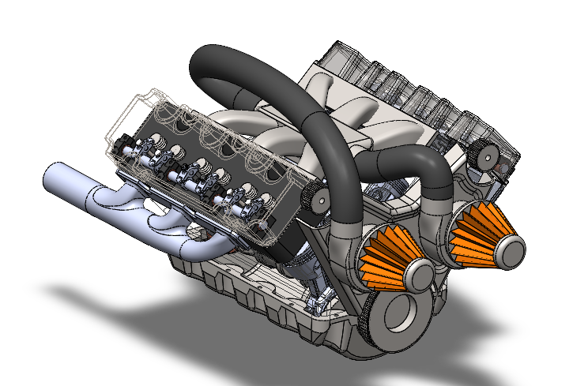
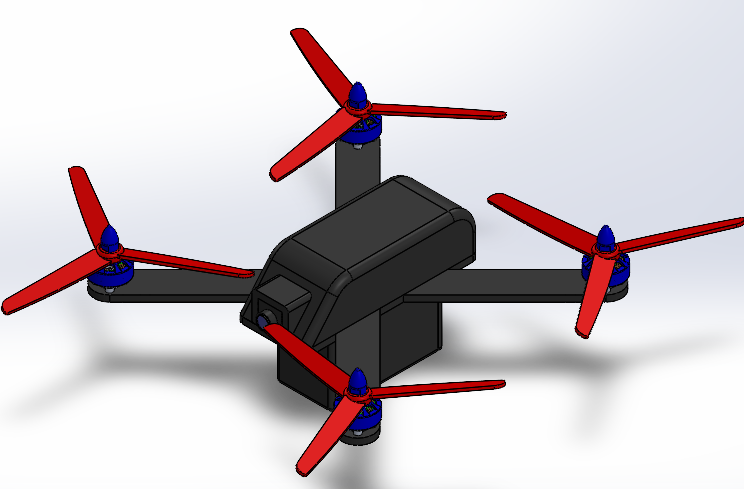

# Hi, I'm Sai Krishna 👋

Mechanical Engineer | CFD & Design Engineer  
Project Associate at IISc Bangalore

## 🔧 Skills & Tools

## 🚀 Areas of Interest
- Vehicle Aerodynamics
- Combustion Modeling
- Turbulence Modeling
- Mechanical Design

## 📂 Projects
- OpenFOAM CFD Simulations
- Combustion Simulations
- Mechanical Design Projects
- Structural Analysis using ANSYS

## 🖼 Design & Simulation Work

### V6 Engine Design

### Bicycle Design

### Air Drone Design

## 🎯 Goal
To contribute to advanced CFD simulations and futuristic vehicle design.
